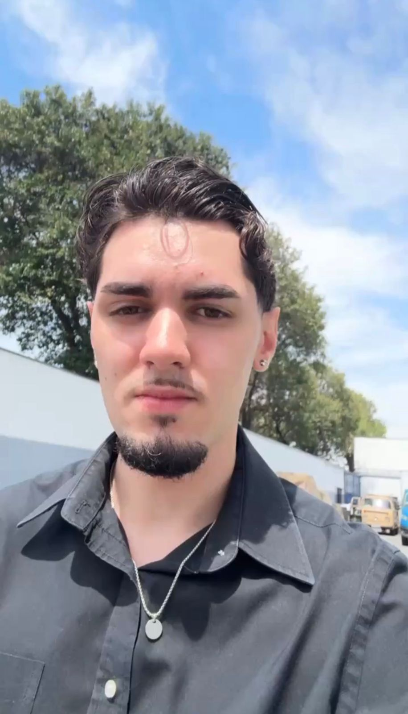

🦷 TechSmile Solutions — Conexão TdB
📝 Descrição do Projeto
O Conexão TdB é um CRM Social desenvolvido para a ONG Turma do Bem, com o objetivo de centralizar a comunicação entre voluntários e beneficiários, automatizando os processos de triagem e gestão de atendimentos odontológicos.
Nesta fase (Sprint 4), a solução evoluiu para um nível profissional com integração direta ao Back-End em Java utilizando DDD (Domain-Driven Design). A aplicação consome endpoints REST reais via Fetch API para operações de CRUD completo, implementa tipagens avançadas com TypeScript e conta com tratamento completo de erros de servidor.
O sistema opera como uma Single Page Application (SPA), proporcionando navegação fluida sem recarregamento de páginas.

📸 Screenshots da Aplicação

  
  

  <em>Interface moderna com foco em responsividade, acessibilidade e integração com API.</em>

🚀 Tecnologias Utilizadas
TecnologiaUso no ProjetoReact 19 + ViteConstrução da SPA com alta performance de renderização e build otimizadoTypeScriptTipagem estática avançada com interfaces, union types e intersection typesTailwind CSSEstilização utilitária para layouts modernos e 100% responsivosReact Router DOMGerenciamento de rotas estáticas (/home, /sobre) e dinâmicas (/integrantes/:id)React Hook FormCaptura, gerenciamento de estados e validação eficiente de formuláriosFetch APIComunicação HTTP assíncrona com Back-End Java (GET, POST, PUT, DELETE) com tratamento de exceçõesJava Spring Boot + DDDArquitetura Back-End baseada em Domain-Driven Design, publicada no Render

📂 Estrutura de Pastas
conexao-tdb/
├── public/
│   └── vite.svg
├── src/
│   ├── assets/               # Imagens, fotos dos integrantes e mídias estáticas
│   ├── components/           # Componentes reutilizáveis
│   │   ├── CardIntegrante.tsx
│   │   ├── Footer.tsx
│   │   ├── Header.tsx
│   │   └── Layout.tsx
│   ├── pages/                # Páginas da aplicação
│   │   ├── Home.tsx
│   │   ├── Sobre.tsx
│   │   ├── FAQ.tsx
│   │   ├── Contato.tsx
│   │   ├── Integrantes.tsx
│   │   ├── IntegranteDetalhe.tsx
│   │   ├── Solucao.tsx
│   │   └── Dashboard.tsx
│   ├── types/                # Interfaces e modelos TypeScript
│   │   └── modelo.ts
│   ├── App.tsx               # Configuração central de rotas
│   ├── main.tsx              # Ponto de entrada da aplicação
│   └── index.css             # Estilos globais com Tailwind CSS
├── index.html
├── vercel.json               # Configuração de deploy para SPA na Vercel
├── tsconfig.json
├── tsconfig.app.json
├── tsconfig.node.json
├── vite.config.ts
├── tailwind.config.js
├── package.json
└── README.md

👥 Autores e Créditos
Equipe TechSmile Solutions — Análise e Desenvolvimento de Sistemas | FIAP
FotoNomeRMTurmaLinksArthur Lins Belarmino5668451TDSPS Henrique Spoltore M. P. dos Santos5681301TDSPSRaphael Oliveira S. M. de Mendonça5683461TDSPS

⚙️ Como Usar
Pré-requisitos

Node.js 18+
npm ou yarn

Instalação e execução local
bash# Clone o repositório
git clone https://github.com/ArthurLinsBelarmino/techsmile-sprint4.git

# Entre na pasta do projeto
cd challenge-conexao-tdb-main

# Instale as dependências
npm install

# Inicie o servidor de desenvolvimento
npm run dev
A aplicação estará disponível em http://localhost:5173.
Links da Entrega

RecursoURL🌐 Deploy (Vercel)https://challenge-conexao-tdb-u296.vercel.app🎥 Vídeo de Apresentação (YouTube)https://youtu.be/DV0x4LhSsKs📁 Repositório (GitHub)https://github.com/ArthurLinsBelarmino/techsmile-sprint4☁️ API Back-End (Render)https://crm-social-sprint4-java.onrender.com

📬 Contato
Dúvidas sobre a arquitetura da SPA, integração com a API Java ou qualquer aspecto técnico do projeto, entre em contato com os responsáveis:

Arthur Lins Belarmino — rm566845@fiap.com.br
Henrique Spoltore — rm568130@fiap.com.br
Raphael Mendonça — rm568346@fiap.com.br

  Desenvolvido com 💜 pela <strong>TechSmile Solutions</strong> — FIAP 2026

